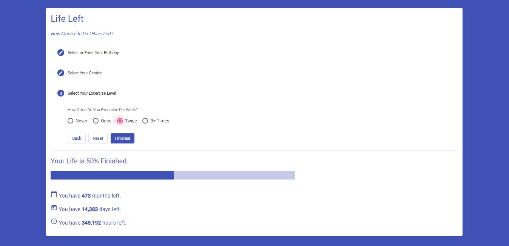

<p align="center">
  
</p>
<p align="center">
  <a href="#">
    
  </a>
  <a href="#">
    
  </a>
  <a href="#">
    
  </a>
</p>
<hr>
<h1 align="center">Life Left</h1>
<h4 align="center">Find out how much life you have left with this interactive calculator.</h4>
<h3 align="center"><a href="https://projects.jsrath.com/life-left">LIVE SITE</a></h3>

Life Left utilizes Angular, Angular Material and Moment.js to calculate your statistical death date using actuarial tables from the US Social Security Administration. 

Enter your information and see how much longer you have!

## Installation

```sh
git clone https://github.com/jsrath/life-left.git
npm install 
ng serve
```

## License

> The MIT License (MIT)<br/> Copyright © 2019 JS Rath <br/> Permission is hereby granted, free of charge, to any person obtaining a copy of this software and associated documentation files (the “Software”), to deal in the Software without restriction, including without limitation the rights to use, copy, modify, merge, publish, distribute, sublicense, and/or sell copies of the Software, and to permit persons to whom the Software is furnished to do so, subject to the following conditions: <br/>The above copyright notice and this permission notice shall be included in all copies or substantial portions of the Software. <br/> The software is provided “as is”, without warranty of any kind, express or implied, including but not limited to the warranties of merchantability, fitness for a particular purpose and noninfringement. In no event shall the authors or copyright holders be liable for any claim, damages or other liability, whether in an action of contract, tort or otherwise, arising from, out of or in connection with the software or the use or other dealings in the software.

---

Created and maintained by [JS Rath](http://www.jsrath.com).
